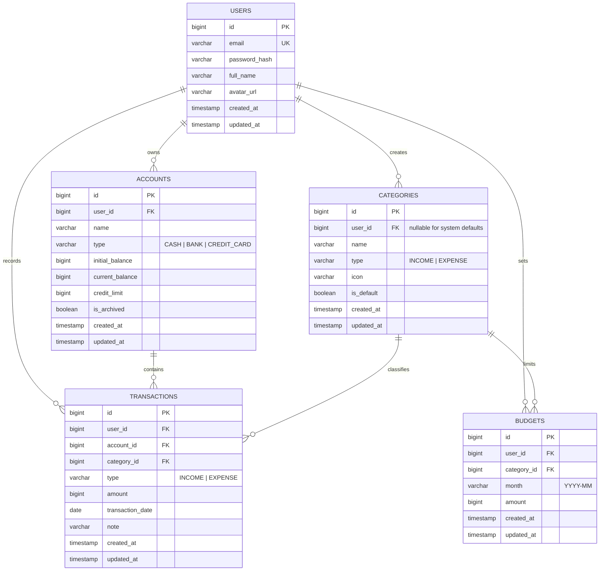
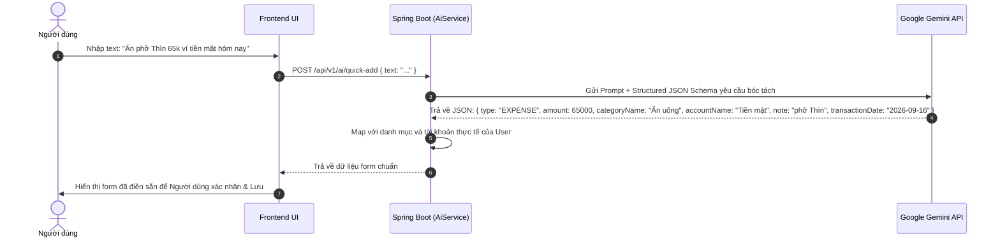

# ARCHITECTURE — FinMan System Architecture
## Hệ Thống Quản Lý Tài Chính Cá Nhân FinMan

---

# 1. Tổng Quan Kiến Trúc (Architecture Overview)

FinMan được thiết kế theo mô hình **Client-Server đa tầng (Multi-tier Architecture)** hiện đại, phân tách hoàn toàn giữa giao diện người dùng (Frontend) và tầng xử lý nghiệp vụ (Backend), kết hợp với dịch vụ trí tuệ nhân tạo (AI Service).

```mermaid
graph TD
    Client["Client Layer\n(Web UI / Mobile PWA / Stitch Interface)"]
    
    subgraph Backend ["Backend Layer (Spring Boot 3.x)"]
        Security["Spring Security 6 & JWT Filter"]
        Controller["REST API Controllers\n(/api/v1/*)"]
        Service["Service Layer\n(Transaction, Balance, Budget Engine)"]
        Repository["Spring Data JPA Repositories"]
    end
    
    subgraph AI ["AI Service"]
        GeminiClient["Google Gemini API Client\n(Gemini 2.0 / 1.5 Flash)"]
    end
    
    subgraph Data ["Persistence Layer"]
        Database[("PostgreSQL / MySQL\nRelational Database")]
    end

    Client -->|HTTPS / REST API (JSON)| Security
    Security --> Controller
    Controller --> Service
    Service --> Repository
    Service -->|Prompt / Structured JSON| GeminiClient
    Repository -->|Hibernate / SQL| Database
```

### Các nguyên tắc kiến trúc cốt lõi:
1. **Stateless Backend**: Backend không lưu session người dùng trong memory, sử dụng JWT (JSON Web Token) để xác thực.
2. **ACID Financial Integrity**: Mọi thao tác ghi nhận dòng tiền (Thêm/Sửa/Xóa giao dịch) đều được bọc trong `@Transactional` của Spring để đảm bảo tính toàn vẹn số dư tài khoản.
3. **Multi-tenant Data Isolation**: Mọi truy vấn đọc/ghi đều bắt buộc kèm theo `userId` của người dùng đã xác thực, triệt tiêu nguy cơ rò rỉ dữ liệu chéo (IDOR).
4. **Zero-Float Precision**: Tất cả dữ liệu tiền tệ được xử lý bằng kiểu số nguyên `Long` (đơn vị Đồng - VND) để loại bỏ hoàn toàn lỗi sai số làm tròn số thực.
5. **Lean & High Performance**: Lược bỏ các bảng phụ trợ phức tạp, chỉ giữ 5 bảng thực thể cốt lõi.

---

# 2. Tech Stack Chi Tiết

| Tầng (Layer) | Công nghệ lựa chọn | Mục đích & Lý do lựa chọn |
|---|---|---|
| **Frontend** | React / Next.js / Vanilla Modern UI | Xây dựng giao diện Web/Mobile responsive theo mockup Stitch, tiêu thụ REST API. |
| **Backend Framework** | **Java 17/21 + Spring Boot 3.x** | Nền tảng enterprise vững chắc, độ ổn định cao, quản lý transaction tài chính chuẩn mực. |
| **Security** | Spring Security 6 + JJWT | Xác thực stateless JWT Bearer Token, mã hóa mật khẩu BCrypt. |
| **ORM / Data Access** | Spring Data JPA (Hibernate) | Quản lý quan hệ thực thể, tối ưu truy vấn với JPQL & Specification, hỗ trợ migration. |
| **Database** | PostgreSQL (khuyến nghị) / MySQL | Hệ quản trị cơ sở dữ liệu quan hệ mạnh mẽ, ACID tuyệt đối, hỗ trợ kiểu dữ liệu `BIGINT`. |
| **AI Integration** | Google Gemini API (REST Client) | Xử lý ngôn ngữ tự nhiên bóc tách câu giao dịch tiếng Việt và tạo báo cáo nhận xét tài chính. |
| **Excel Export** | Apache POI | Thư viện Java sinh file `.xlsx` chuẩn native, streaming xuất báo cáo trực tiếp về client. |
| **Build & Tooling** | Maven, Docker, Lombok, Jakarta Validation | Quản lý phụ thuộc, container hóa môi trường và tự động hóa validation DTO. |

---

# 3. Database Architecture & ERD (Thiết Kế Cơ Sở Dữ Liệu)

Hệ thống tập trung vào 5 bảng cốt lõi phục vụ trọn vẹn nghiệp vụ quản lý tài chính cá nhân:



### 3.1 Chi tiết các bảng

#### Bảng `users`
Lưu trữ tài khoản người dùng đăng nhập hệ thống.
- `id` (BIGINT, PK, Auto Increment)
- `email` (VARCHAR(100), UNIQUE, NOT NULL): Email đăng nhập.
- `password_hash` (VARCHAR(255), NOT NULL): Mật khẩu băm BCrypt.
- `full_name` (VARCHAR(100), NOT NULL): Họ và tên hiển thị.
- `avatar_url` (VARCHAR(500), NULL): Đường dẫn ảnh đại diện.
- `created_at`, `updated_at` (TIMESTAMP WITH TIME ZONE)

#### Bảng `accounts`
Quản lý ví tiền mặt, tài khoản ngân hàng và thẻ tín dụng.
- `id` (BIGINT, PK, Auto Increment)
- `user_id` (BIGINT, FK -> users.id, NOT NULL): Định danh chủ sở hữu.
- `name` (VARCHAR(50), NOT NULL): Tên tài khoản (Ví dụ: "Tiền mặt", "Vietcombank", "Thẻ Techcombank Visa").
- `type` (VARCHAR(20), NOT NULL): Thuộc `CASH`, `BANK`, `CREDIT_CARD`.
- `initial_balance` (BIGINT, NOT NULL, DEFAULT 0): Số dư lúc khởi tạo ví (đơn vị VNĐ).
- `current_balance` (BIGINT, NOT NULL, DEFAULT 0): Số dư khả dụng hiện tại (hoặc dư nợ hiện tại đối với thẻ tín dụng).
- `credit_limit` (BIGINT, NULL, DEFAULT 0): Hạn mức tín dụng (áp dụng cho `CREDIT_CARD`).
- `is_archived` (BOOLEAN, NOT NULL, DEFAULT FALSE): Trạng thái đóng/ẩn tài khoản thay vì xóa cứng.
- `created_at`, `updated_at` (TIMESTAMP WITH TIME ZONE)

#### Bảng `categories`
Phân loại các khoản chi tiêu và thu nhập.
- `id` (BIGINT, PK, Auto Increment)
- `user_id` (BIGINT, FK -> users.id, NULL): Nếu `NULL` là danh mục hệ thống mặc định, có giá trị là danh mục do người dùng tự tạo.
- `name` (VARCHAR(50), NOT NULL): Tên danh mục ("Ăn uống", "Lương", "Áo quần"...).
- `type` (VARCHAR(20), NOT NULL): Thuộc `INCOME` hoặc `EXPENSE`.
- `icon` (VARCHAR(50), NULL): Biểu tượng hoặc emoji (ví dụ: `🍜`, `💰`, `👕`).
- `is_default` (BOOLEAN, NOT NULL, DEFAULT FALSE): Đánh dấu danh mục ban đầu do hệ thống tạo.
- `created_at`, `updated_at` (TIMESTAMP WITH TIME ZONE)

#### Bảng `transactions`
Lưu trữ toàn bộ lịch sử biến động tiền tệ.
- `id` (BIGINT, PK, Auto Increment)
- `user_id` (BIGINT, FK -> users.id, NOT NULL)
- `account_id` (BIGINT, FK -> accounts.id, NOT NULL): Tài khoản phát sinh giao dịch.
- `category_id` (BIGINT, FK -> categories.id, NOT NULL): Danh mục thu/chi.
- `type` (VARCHAR(20), NOT NULL): Thuộc `INCOME` hoặc `EXPENSE` (Không có chuyển khoản).
- `amount` (BIGINT, NOT NULL): Số tiền giao dịch (luôn dương > 0).
- `transaction_date` (DATE, NOT NULL): Ngày phát sinh giao dịch (YYYY-MM-DD).
- `note` (VARCHAR(255), NULL): Ghi chú diễn giải.
- `created_at`, `updated_at` (TIMESTAMP WITH TIME ZONE)

#### Bảng `budgets`
Thiết lập hạn mức chi tiêu cho từng danh mục theo tháng.
- `id` (BIGINT, PK, Auto Increment)
- `user_id` (BIGINT, FK -> users.id, NOT NULL)
- `category_id` (BIGINT, FK -> categories.id, NOT NULL): Danh mục chi tiêu được áp hạn mức.
- `month` (VARCHAR(7), NOT NULL): Chu kỳ tháng áp dụng, định dạng `YYYY-MM` (Ví dụ: `2026-09`).
- `amount` (BIGINT, NOT NULL): Hạn mức ngân sách tối đa trong tháng (VNĐ).
- `created_at`, `updated_at` (TIMESTAMP WITH TIME ZONE)
- **Ràng buộc duy nhất (Unique Constraint)**: `UNIQUE (user_id, category_id, month)` — mỗi danh mục chỉ có 1 ngân sách duy nhất trong 1 tháng.

### 3.2 Database Indexes tối ưu hiệu năng
- `CREATE INDEX idx_transactions_user_date ON transactions(user_id, transaction_date DESC);` (Tối ưu tải danh sách giao dịch phân trang theo thời gian).
- `CREATE INDEX idx_transactions_user_account ON transactions(user_id, account_id);` (Tối ưu tính toán và kiểm tra số dư).
- `CREATE INDEX idx_budgets_user_month ON budgets(user_id, month);` (Tối ưu màn hình ngân sách).
- `CREATE INDEX idx_accounts_user ON accounts(user_id) WHERE is_archived = FALSE;` (Tối ưu tải danh sách ví hoạt động).

---

# 4. Cấu Trúc Dự Án Toàn Diện (Monorepo Layout)

Dự án FinMan được tổ chức theo mô hình Monorepo sạch, phân tách rõ ràng giữa Backend, Frontend, Tài liệu thiết kế Stitch và Kế hoạch kỹ thuật:

```text
d:\FinMan/
├── backend/                             # [BACKEND] Mã nguồn Java Spring Boot 3.x
│   ├── src/main/java/com/finman/
│   │   ├── config/                      # Cấu hình Spring Security, CORS, Gemini REST Client
│   │   ├── controller/                  # REST API Controllers (/api/v1/*)
│   │   ├── dto/                         # Request & Response DTOs
│   │   ├── entity/                      # JPA Entities (User, Account, Category, Transaction, Budget)
│   │   ├── exception/                   # Global Exception Handler
│   │   ├── repository/                  # Spring Data JPA Repositories
│   │   ├── security/                    # JWT Provider & Authentication Filter
│   │   └── service/                     # Transaction Engine, Budget Engine, AI, Export
│   ├── src/main/resources/              # application.yml, seed data
│   └── pom.xml                          # Maven build dependencies
│
├── frontend/                            # [FRONTEND] Ứng dụng Web / Mobile PWA (React + Vite)
│   ├── public/
│   │   ├── logo-fm.png                  # Logo FM 3D kim loại vàng lấy từ design/00_branding_logo
│   │   └── manifest.json                # Cấu hình Mobile PWA
│   ├── src/
│   │   ├── assets/                      # Hình ảnh & icon tĩnh
│   │   ├── components/                  # UI Components (BottomNav, TopBar, Modal, Buttons)
│   │   ├── context/                     # AuthContext, FinancialContext
│   │   ├── pages/                       # Các trang bóc tách trực tiếp từ Stitch design
│   │   │   ├── auth/                    # Splash, Login, Register, Forgot Password
│   │   │   ├── transactions/            # Home Dashboard, Add Transaction, Calendar
│   │   │   ├── accounts/                # Accounts Management & Net Worth
│   │   │   ├── budget/                  # Budget Management & Alerts
│   │   │   ├── statistics/              # Charts & Category Breakdown
│   │   │   ├── ai/                      # AI Assistant & Quick Add
│   │   │   └── settings/                # Profile, Excel Export, Logout
│   │   ├── services/                    # Axios API Clients kết nối Spring Boot
│   │   ├── index.css                    # Tailwind CSS base styles & typography
│   │   └── App.tsx                      # App Routing
│   ├── tailwind.config.js               # Tokens trích xuất từ design/14_design_system_reference
│   └── package.json
│
├── design/                              # [STITCH UI SOURCE] 15 Thư mục màn hình mẫu chuẩn hóa
│   ├── 00_branding_logo/                # Logo FM 3D huy hiệu vàng kim loại (screen.png)
│   ├── 01_splash_screen/                # Splash Screen (code.html & screen.png)
│   ├── 02_login/                        # Màn hình Đăng nhập
│   ├── 03_register/                     # Màn hình Đăng ký
│   ├── 04_forgot_password/              # Màn hình Quên mật khẩu
│   ├── 05_google_login/                 # Chọn tài khoản Google Auth
│   ├── 06_transactions_home/            # Màn hình Giao dịch Home
│   ├── 07_add_transaction/              # Màn hình Thêm giao dịch (Thu/Chi)
│   ├── 08_calendar/                     # Màn hình Lịch giao dịch
│   ├── 09_statistics/                   # Màn hình Thống kê chi tiêu
│   ├── 10_accounts/                     # Màn hình Quản lý tài khoản ví
│   ├── 11_budget/                       # Màn hình Quản lý ngân sách
│   ├── 12_ai_assistant/                 # Màn hình Trợ lý AI (Quick Add)
│   ├── 13_more_settings/                # Màn hình Cài đặt & Xuất dữ liệu
│   └── 14_design_system_reference/      # Tài liệu tổng hợp Design Tokens
│
├── plans/                               # [PLANS] Bộ 6 tài liệu kỹ thuật
│   ├── PRD.md
│   ├── ARCHITECTURE.md
│   ├── CODE_PLAN.md
│   ├── GEMINI.md
│   ├── TEST_PLAN.md
│   └── PROCESS.md
│
└── docker-compose.yml                   # Khởi chạy PostgreSQL môi trường dev
```

---

# 5. Backend Layer Architecture (Spring Boot 3.x)

Backend được tổ chức theo kiến trúc chuẩn mực Spring Boot với phân tách rõ ràng các tầng:

### 4.1 Cơ chế cập nhật số dư tài khoản (Transaction Engine)
Mỗi thao tác ghi nhận giao dịch tại `TransactionService` đều phải đảm bảo:
```java
@Transactional
public TransactionResponse createTransaction(Long userId, CreateTransactionRequest request) {
    // 1. Validate Account & Category thuộc sở hữu của User
    // 2. Lưu Transaction Entity
    // 3. Cập nhật số dư Account tương ứng:
    //    - Nếu INCOME: account.setCurrentBalance(account.getCurrentBalance() + request.getAmount())
    //    - Nếu EXPENSE: account.setCurrentBalance(account.getCurrentBalance() - request.getAmount())
    // 4. Lưu Account Entity (Hibernate tự động commit hoặc rollback nếu lỗi)
}
```

---

# 5. AI Service Component (Gemini Integration)

Hệ thống sử dụng **Google Gemini REST API** (`gemini-2.0-flash` hoặc `gemini-1.5-flash`) nhờ tốc độ phản hồi cực nhanh (< 1 giây) và chi phí tối ưu.



### Prompt Template cho Natural Language Quick Add:
```text
System: Bạn là trợ lý trích xuất dữ liệu giao dịch tài chính cho ứng dụng FinMan tại Việt Nam.
Nhiệm vụ: Phân tích câu nói/văn bản của người dùng và trích xuất thành JSON thuần túy theo schema:
{
  "type": "INCOME" hoặc "EXPENSE",
  "amount": số nguyên dương (đơn vị VNĐ, ví dụ: 50k -> 50000, 1.5 triệu -> 1500000),
  "categoryName": tên danh mục gợi ý phù hợp nhất (Ăn uống, Giải trí, Lương, Áo quần...),
  "accountName": tên tài khoản ví (Tiền mặt, Ngân hàng...),
  "note": mô tả ngắn gọn nội dung chi tiêu,
  "transactionDate": ngày theo định dạng YYYY-MM-DD (nếu nói 'hôm nay' thì lấy {currentDate}, 'hôm qua' thì trừ 1 ngày)
}
Chỉ trả về duy nhất chuỗi JSON hợp lệ, không kèm markdown hoặc giải thích thêm.
```

---

# 6. REST API Specification

### 6.1 Chuẩn phản hồi chung (ApiResponse Format)
```json
{
  "success": true,
  "message": "Thao tác thành công",
  "data": { ... },
  "timestamp": 1758000000000
}
```
Khi có lỗi nghiệp vụ hoặc validation:
```json
{
  "success": false,
  "message": "Dữ liệu không hợp lệ",
  "error": {
    "code": "VALIDATION_FAILED",
    "details": {
      "amount": "Số tiền phải lớn hơn 0",
      "email": "Email không đúng định dạng"
    }
  },
  "timestamp": 1758000000000
}
```

### 6.2 Danh sách Endpoints cốt lõi

| Module | Method | Endpoint | Mô tả |
|---|---|---|---|
| **Auth** | `POST` | `/api/v1/auth/register` | Đăng ký tài khoản mới + tự sinh ví mặc định và danh mục mẫu |
| **Auth** | `POST` | `/api/v1/auth/login` | Đăng nhập bằng email/password, trả về JWT Access Token |
| **Auth** | `GET` | `/api/v1/auth/me` | Lấy thông tin cá nhân của người dùng hiện tại |
| **Accounts** | `GET` | `/api/v1/accounts` | Danh sách các ví/tài khoản (Tiền mặt, Ngân hàng, Thẻ tín dụng) kèm số dư |
| **Accounts** | `POST` | `/api/v1/accounts` | Tạo tài khoản/ví tiền mới |
| **Accounts** | `PUT` | `/api/v1/accounts/{id}` | Cập nhật thông tin tài khoản |
| **Accounts** | `DELETE` | `/api/v1/accounts/{id}` | Lưu trữ (archive) hoặc xóa tài khoản nếu chưa có giao dịch |
| **Categories** | `GET` | `/api/v1/categories` | Lấy danh sách danh mục phân loại (hệ thống + người dùng tự tạo) |
| **Categories** | `POST` | `/api/v1/categories` | Tạo danh mục mới |
| **Categories** | `PUT` | `/api/v1/categories/{id}` | Đổi tên/icon danh mục |
| **Categories** | `DELETE` | `/api/v1/categories/{id}` | Xóa danh mục (nếu chưa có giao dịch liên kết) |
| **Transactions**| `GET` | `/api/v1/transactions` | Lấy danh sách giao dịch hỗ trợ filter: `month=YYYY-MM`, `from`, `to`, `accountId`, `categoryId`, `keyword` |
| **Transactions**| `POST` | `/api/v1/transactions` | Tạo giao dịch Thu hoặc Chi (+/- số dư tài khoản tương ứng) |
| **Transactions**| `GET` | `/api/v1/transactions/{id}` | Chi tiết một giao dịch |
| **Transactions**| `PUT` | `/api/v1/transactions/{id}` | Chỉnh sửa giao dịch (tự động hoàn tác số dư cũ và áp số dư mới) |
| **Transactions**| `DELETE`| `/api/v1/transactions/{id}` | Xóa giao dịch (hoàn lại số tiền vào tài khoản tương ứng) |
| **Budgets** | `GET` | `/api/v1/budgets` | Lấy danh sách ngân sách tháng `?month=YYYY-MM` kèm số tiền đã chi & còn lại |
| **Budgets** | `POST` | `/api/v1/budgets` | Thiết lập hoặc cập nhật ngân sách cho danh mục |
| **Budgets** | `DELETE` | `/api/v1/budgets/{id}` | Xóa thiết lập ngân sách |
| **AI** | `POST` | `/api/v1/ai/quick-add` | Gửi câu văn bản tự nhiên để AI bóc tách thông tin giao dịch |
| **AI** | `POST` | `/api/v1/ai/insights` | Yêu cầu AI tổng hợp phân tích tài chính và đưa ra nhận xét tháng `YYYY-MM` |
| **Export** | `GET` | `/api/v1/export/excel` | Tải về file `.xlsx` toàn bộ lịch sử giao dịch theo khoảng thời gian |

---

# 7. Security & Non-Functional Requirements

1. **Authentication & Authorization**:
   - Sử dụng JWT Stateless với thời gian hết hạn hợp lý (ví dụ: 7 ngày hoặc 24h kết hợp refresh).
   - Filter `JwtAuthenticationFilter` giải mã token, lấy `userId` gán vào `SecurityContextHolder`.
2. **Data Isolation (Tenant Boundary)**:
   - Tất cả các truy vấn JPA bắt buộc phải có điều kiện `WHERE user_id = :currentUserId`.
   - Ngăn chặn triệt để lỗ hổng IDOR khi một người dùng cố tình truyền ID giao dịch của người khác.
3. **Mã hóa mật khẩu**:
   - Sử dụng chuẩn `BCryptPasswordEncoder` với độ dài salt 10-12 vòng.
4. **CORS Configuration**:
   - Cấu hình cho phép Frontend truy cập an toàn với các header `Authorization`, `Content-Type`.
5. **Độ chính xác dữ liệu tài chính**:
   - Sử dụng kiểu dữ liệu `BIGINT` trong cơ sở dữ liệu và `Long` trong mã nguồn Java. Không phát sinh số thập phân cho đồng VND.
