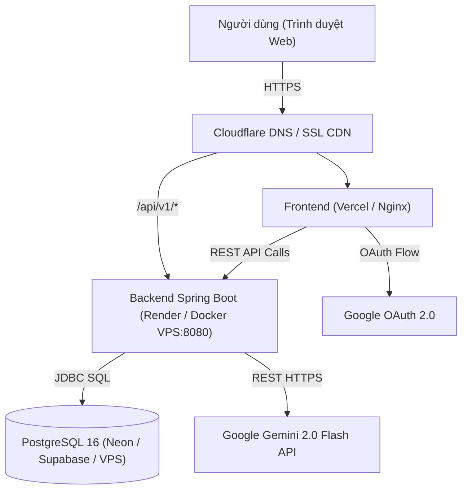

# KẾ HOẠCH TRIỂN KHAI FINMAN LÊN INTERNET (DEPLOYMENT PLAN)

> **Dự án**: FinMan - Hệ thống Quản lý Tài chính Cá nhân Thông minh  
> **Phiên bản tài liệu**: 1.0.0  
> **Ngày lập**: 21/09/2026  
> **Trạng thái**: Sẵn sàng triển khai (Production Ready)

---

## 1. TỔNG QUAN KIẾN TRÚC & YÊU CẦU HỆ THỐNG

### 1.1. Kiến trúc phân tầng
FinMan được thiết kế theo kiến trúc Client - Server tách biệt, hỗ trợ đóng gói độc lập:
- **Frontend**: Single Page Application (SPA) xây dựng bằng **React 19, TypeScript, Vite, Tailwind CSS**. Kết quả build là gói static web (HTML, JS, CSS).
- **Backend**: RESTful API xây dựng bằng **Java 17, Spring Boot 3**, đóng gói dạng Multi-stage Container ([backend/Dockerfile](file:///d:/FinMan/backend/Dockerfile)).
- **Database**: **PostgreSQL 16** lưu trữ quan hệ với connection pooling HikariCP.
- **Tích hợp bên ngoài**:
  - Google Gemini 2.0 Flash API (Trợ lý tài chính AI).
  - Google OAuth 2.0 (Đăng nhập tài khoản Google).



---

## 2. LỰA CHỌN PHƯƠNG ÁN TRIỂN KHAI

Tùy thuộc vào ngân sách và mục đích sử dụng, chọn một trong hai phương án sau:

| Tiêu chí so sánh | **Phương án 1: Cloud PaaS Miễn Phí (0 VNĐ)** | **Phương án 2: VPS Riêng (Production 24/7)** |
| :--- | :--- | :--- |
| **Phù hợp cho** | Đồ án, portfolio, demo nhà tuyển dụng, test tính năng | Ứng dụng chạy thực tế lâu dài, dữ liệu người dùng thật |
| **Frontend** | **Vercel** / **Netlify** | Nginx trên VPS (phục vụ static files từ build) |
| **Backend** | **Render.com** / **Koyeb** (Build qua Dockerfile) | Docker container chạy trực tiếp trên VPS |
| **Database** | **Neon.tech** / **Supabase** (PostgreSQL Serverless) | PostgreSQL container nội bộ trên VPS kèm Volume |
| **Chi phí** | **0 VNĐ / tháng** | **~100.000 - 150.000 VNĐ / tháng** (~$4 - $6) |
| **Bảo trì server** | Không cần quản trị server, tự deploy khi git push | Tự cấu hình Nginx, Firewall, sao lưu DB định kỳ |
| **Hiện tượng Cold Start** | Có (Render Free ngủ sau 15p rảnh, mất ~30s tỉnh dậy) | Không có, hệ thống chạy liên tục 24/7 tốc độ cao |

---

## 3. BẢNG BIẾN MÔI TRƯỜNG CẦN CHUẨN BỊ (ENVIRONMENT SECRETS)

Trước khi tiến hành deploy, chuẩn bị đầy đủ các biến môi trường sau:

| Tên biến | Phạm vi | Mục đích | Ví dụ giá trị |
| :--- | :--- | :--- | :--- |
| `SPRING_DATASOURCE_URL` | Backend | URL kết nối PostgreSQL (JDBC) | `jdbc:postgresql://ep-xyz.neon.tech/finman?sslmode=require` |
| `SPRING_DATASOURCE_USERNAME` | Backend | Tên người dùng database | `finman_user` hoặc `postgres` |
| `SPRING_DATASOURCE_PASSWORD` | Backend | Mật khẩu database | `Mật khẩu bảo mật mạnh` |
| `JWT_SECRET` | Backend | Chuỗi secret mã hóa JWT (HMAC-SHA256) | Sinh bằng lệnh: `openssl rand -hex 32` |
| `GEMINI_API_KEY` | Backend | Khóa API trợ lý AI Gemini | Lấy tại: [Google AI Studio](https://aistudio.google.com/) |
| `APP_CORS_ALLOWED_ORIGINS` | Backend | Danh sách domain Frontend được gọi API | `https://finman-app.vercel.app` |
| `VITE_API_URL` | Frontend | Địa chỉ Backend API cho client gọi tới | `https://finman-api.onrender.com/api/v1` |
| `VITE_GOOGLE_CLIENT_ID` | Frontend | Web Client ID xác thực Google OAuth | Lấy từ Google Cloud Console Credentials |

> [!TIP]
> **Cách sinh chuỗi `JWT_SECRET` an toàn**:  
> Chạy lệnh trong terminal:
> ```bash
> openssl rand -hex 32
> ```
> Kết quả là chuỗi 64 ký tự hex (256-bit) chuẩn hóa, không dùng các chuỗi mặc định dễ đoán.

---

## 4. CHI TIẾT TRIỂN KHAI PHƯƠNG ÁN 1: CLOUD PAAS (MIỄN PHÍ 0 VNĐ)

### Bước 4.1: Đẩy mã nguồn lên GitHub
Tất cả các nền tảng PaaS (Vercel, Render) đều kéo mã nguồn từ GitHub:
```bash
# 1. Kiểm tra trạng thái git
git status

# 2. Thêm và commit toàn bộ code
git add .
git commit -m "feat: prepare production configuration for deployment"

# 3. Đẩy lên nhánh main
git push origin main
```

---

### Bước 4.2: Tạo PostgreSQL miễn phí trên Neon.tech
1. Truy cập [Neon.tech](https://neon.tech/) $\rightarrow$ Đăng nhập bằng GitHub.
2. Nhấn **Create Project** $\rightarrow$ Đặt tên dự án: `finman-db`.
3. Chọn Region gần Việt Nam nhất: **Singapore (ap-southeast-1)**.
4. Sau khi tạo xong, tại Dashboard chuyển chế độ hiển thị chuỗi kết nối sang **Java / JDBC**:
   - URL mẫu: `jdbc:postgresql://ep-cool-fog-123456.ap-southeast-1.aws.neon.tech/finman?sslmode=require`
   - Lưu lại **Host**, **Database**, **Username**, **Password**.

---

### Bước 4.3: Deploy Backend lên Render.com
1. Truy cập [Render.com](https://render.com/) $\rightarrow$ Đăng nhập bằng GitHub.
2. Chọn **New +** $\rightarrow$ Chọn **Web Service**.
3. Chọn Repository `aimeeceline/FinMan`.
4. Cấu hình thông tin dịch vụ:
   - **Name**: `finman-backend`
   - **Region**: **Singapore** (cùng vùng với Neon DB để giảm độ trễ ping).
   - **Root Directory**: `backend` *(Rất quan trọng: để Render chỉ build thư mục backend)*.
   - **Runtime**: **Docker** *(Render sẽ tự nhận diện `backend/Dockerfile`)*.
   - **Instance Type**: **Free** ($0/tháng).
5. Cuộn xuống phần **Environment Variables** và thêm các khóa:
   - `SPRING_DATASOURCE_URL`: *(Dán chuỗi JDBC từ Neon)*
   - `SPRING_DATASOURCE_USERNAME`: *(Username từ Neon)*
   - `SPRING_DATASOURCE_PASSWORD`: *(Password từ Neon)*
   - `JWT_SECRET`: *(Chuỗi 64 hex đã sinh)*
   - `GEMINI_API_KEY`: *(Key từ Google AI Studio)*
   - `APP_CORS_ALLOWED_ORIGINS`: `*` *(Tạm thời để `*`, sau khi có domain Vercel sẽ cập nhật lại)*
6. Nhấn **Create Web Service**. Chờ ~3-5 phút để Render build Docker image và khởi chạy.
7. Khi deploy thành công, bạn sẽ nhận được URL: `https://finman-backend.onrender.com`.

---

### Bước 4.4: Deploy Frontend lên Vercel
1. Truy cập [Vercel.com](https://vercel.com/) $\rightarrow$ Đăng nhập bằng GitHub.
2. Chọn **Add New...** $\rightarrow$ **Project** $\rightarrow$ Chọn repo `FinMan`.
3. Cấu hình Project:
   - **Framework Preset**: `Vite`
   - **Root Directory**: Nhấn **Edit** $\rightarrow$ Chọn thư mục `frontend`.
   - **Build Command**: `npm run build`
   - **Output Directory**: `dist`
4. Mở rộng mục **Environment Variables**:
   - `VITE_API_URL`: `https://finman-backend.onrender.com/api/v1` *(Thay bằng URL Render của bạn)*
   - `VITE_GOOGLE_CLIENT_ID`: *(Client ID từ Google Console)*
5. Nhấn **Deploy**. Quá trình build chỉ mất ~1-2 phút.
6. Vercel cấp cho bạn URL truy cập dạng: `https://finman-frontend.vercel.app`.

---

### Bước 4.5: Khóa bảo mật CORS & Cấu hình Google OAuth
1. **Cập nhật CORS trên Render**:
   - Quay lại Dashboard Render $\rightarrow$ `finman-backend` $\rightarrow$ **Environment**.
   - Sửa biến `APP_CORS_ALLOWED_ORIGINS` thành:
     `https://finman-frontend.vercel.app`
   - Render sẽ tự động redeploy trong 30 giây.
2. **Cấu hình Google OAuth**:
   - Truy cập [Google Cloud Console Credentials](https://console.cloud.google.com/apis/credentials).
   - Chọn OAuth 2.0 Client IDs của bạn.
   - Tại mục **Authorized JavaScript origins**, thêm:
     - `https://finman-frontend.vercel.app`
   - Nhấn **Save**.

---

### Bước 4.6: Chống "ngủ đông" (Cold Start) cho Backend Render Free
> [!NOTE]
> Gói Free của Render sẽ chuyển sang trạng thái ngủ (Sleep) nếu không có truy vấn trong 15 phút. Khi có người truy cập, request đầu tiên sẽ mất 30-50 giây để khởi động.
> **Giải pháp khắc phục miễn phí**:
> 1. Đăng ký tài khoản miễn phí tại [cron-job.org](https://cron-job.org/) hoặc [UptimeRobot.com](https://uptimerobot.com/).
> 2. Tạo một lịch kiểm tra định kỳ (Monitor/Ping):
>    - URL: `https://finman-backend.onrender.com/api/v1/auth/ping` (hoặc endpoint GET bất kỳ)
>    - Chu kỳ lặp lại: Cứ **10 phút** gọi một lần.
>    - Server Render sẽ luôn nhận được request định kỳ và không bao giờ bị rơi vào trạng thái ngủ!

---

## 5. CHI TIẾT TRIỂN KHAI PHƯƠNG ÁN 2: THUÊ VPS RIÊNG (PRODUCTION GRADE)

### Bước 5.1: Thuê và khởi tạo VPS Linux
- Cấu hình đề xuất: **2 vCPU, 2GB - 4GB RAM, 20GB SSD** (Ubuntu 22.04 LTS hoặc 24.04 LTS).
- Nhà cung cấp: Hetzner Cloud (rẻ nhất, ~$4/tháng), DigitalOcean, Linode, hoặc VPS trong nước (Vietnix, BKNS, TinoHost để có ping <10ms).
- Trỏ bản ghi DNS tên miền:
  - `A` record `@` $\rightarrow$ `IP_VPS`
  - `A` record `api` (hoặc subdomain tùy chọn) $\rightarrow$ `IP_VPS`

---

### Bước 5.2: Cài đặt môi trường Docker trên VPS
Kết nối SSH vào VPS và chạy chuỗi lệnh sau:
```bash
# 1. Cập nhật hệ điều hành
sudo apt update && sudo apt upgrade -y

# 2. Cài đặt các gói phụ trợ
sudo apt install -y curl git ufw ca-certificates gnupg lsb-release

# 3. Cài đặt Docker Engine & Docker Compose chính thức
curl -fsSL https://get.docker.com -o get-docker.sh
sudo sh get-docker.sh
sudo usermod -aG docker $USER

# 4. Cấu hình Firewall UFW (Bảo mật cổng)
sudo ufw allow 22/tcp    # Cổng SSH
sudo ufw allow 80/tcp    # Cổng HTTP
sudo ufw allow 443/tcp   # Cổng HTTPS
sudo ufw enable
```

---

### Bước 5.3: Chuẩn bị mã nguồn & file cấu hình trên VPS
```bash
# Clone source code về VPS
git clone https://github.com/aimeeceline/FinMan.git /var/www/finman
cd /var/www/finman

# Tạo file biến môi trường bảo mật .env.prod
cat << 'EOF' > .env.prod
POSTGRES_DB=finman
POSTGRES_USER=finman_user
POSTGRES_PASSWORD=MatKhauDatabaseSieuBaoMat2026!
JWT_SECRET=404E635266556A586E3272357538782F413F4428472B4B6250645367566B5970
GEMINI_API_KEY=AIzaSyD...your_real_gemini_key
APP_CORS_ALLOWED_ORIGINS=https://yourdomain.com
EOF
```

---

### Bước 5.4: Build Frontend trên VPS
```bash
cd /var/www/finman/frontend

# Tạo .env cho frontend
echo "VITE_API_URL=https://yourdomain.com/api/v1" > .env

# Cài Node & Build Static Files
curl -fsSL https://deb.nodesource.com/setup_20.x | sudo -E bash -
sudo apt install -y nodejs
npm install
npm run build
# Gói build tĩnh sẽ nằm tại /var/www/finman/frontend/dist
```

---

### Bước 5.5: Cấu hình Nginx làm Reverse Proxy & Cấp SSL Miễn Phí
Cài đặt Nginx:
```bash
sudo apt install -y nginx certbot python3-certbot-nginx
```

Tạo file cấu hình virtual host `/etc/nginx/sites-available/finman`:
```nginx
server {
    listen 80;
    server_name yourdomain.com www.yourdomain.com;

    # 1. Định tuyến Frontend (Serve static files SPA)
    location / {
        root /var/www/finman/frontend/dist;
        index index.html;
        try_files $uri $uri/ /index.html;
    }

    # 2. Định tuyến Backend API sang container Spring Boot (cổng 8080)
    location /api/ {
        proxy_pass http://127.0.0.1:8080/api/;
        proxy_http_version 1.1;
        proxy_set_header Upgrade $http_upgrade;
        proxy_set_header Connection 'upgrade';
        proxy_set_header Host $host;
        proxy_set_header X-Real-IP $remote_addr;
        proxy_set_header X-Forwarded-For $proxy_add_x_forwarded_for;
        proxy_set_header X-Forwarded-Proto $scheme;
        proxy_read_timeout 90;
    }
}
```

Kích hoạt cấu hình và cấp chứng chỉ SSL Let's Encrypt tự động:
```bash
sudo ln -s /etc/nginx/sites-available/finman /etc/nginx/sites-enabled/
sudo rm -f /etc/nginx/sites-enabled/default
sudo nginx -t
sudo systemctl reload nginx

# Cấp chứng chỉ HTTPS (tự động cấu hình SSL và chuyển hướng HTTP -> HTTPS)
sudo certbot --nginx -d yourdomain.com -d www.yourdomain.com
```

---

### Bước 5.6: Khởi chạy Backend & Database bằng Docker
Tại thư mục `/var/www/finman`:
```bash
# Khởi động dịch vụ production ở chế độ background
docker compose -f docker-compose.prod.yml --env-file .env.prod up -d --build

# Kiểm tra tình trạng container
docker compose -f docker-compose.prod.yml ps

# Xem log khởi động backend
docker compose -f docker-compose.prod.yml logs -f backend
```

---

## 6. DANH MỤC KIỂM TRA TRƯỚC KHI BÀN GIAO (PRE-LAUNCH CHECKLIST)

- [ ] **Bảo mật cơ sở dữ liệu**: Không mở cổng 5432 ra Internet công khai; chỉ cho phép kết nối nội bộ hoặc qua SSL (`sslmode=require`).
- [ ] **Khóa bí mật (Secrets)**: Không commit file `.env` hoặc chuỗi mật khẩu vào repository Git công khai.
- [ ] **CORS Policy**: Đã hạn chế `APP_CORS_ALLOWED_ORIGINS` trỏ đúng vào domain production của website.
- [ ] **HTTPS / SSL**: Toàn bộ lưu lượng Frontend và Backend đều chạy qua giao thức bảo mật `https://`.
- [ ] **Tài khoản mặc định**: Thay đổi toàn bộ mật khẩu mặc định của admin / test.
- [ ] **AI Assistant**: Đã điền `GEMINI_API_KEY` hợp lệ và kiểm tra tính năng chat tài chính hoạt động mượt mà.
- [ ] **Tự động sao lưu Database**: Đã thiết lập cron job sao lưu dữ liệu tự động định kỳ:
  ```bash
  # Mẫu backup tự động hàng ngày lúc 2:00 AM trên VPS:
  0 2 * * * docker exec finman-postgres-prod pg_dump -U postgres finman | gzip > /var/backups/finman_$(date +\%F).sql.gz
  ```

---

## 7. KẾ HOẠCH KHẮC PHỤC SỰ CỐ & ROLLBACK (DISASTER RECOVERY)

1. **Rollback Backend**:
   - Khi bản deploy mới phát sinh lỗi, chuyển nhanh về commit ổn định trước đó:
     ```bash
     git reset --hard <commit-hash-on-dinh>
     docker compose -f docker-compose.prod.yml up -d --build
     ```
   - Trên Render: Chọn bản build trước trong tab **Deploys** $\rightarrow$ Nhấn **Rollback to this deploy**.
2. **Rollback Frontend (Vercel)**:
   - Truy cập Vercel Dashboard $\rightarrow$ Tab **Deployments** $\rightarrow$ Chọn bản deploy trước đó $\rightarrow$ Nhấn **Promote to Production** (thời gian hoàn tất: dưới 5 giây).
3. **Phục hồi Database từ file sao lưu**:
   ```bash
   gunzip < /var/backups/finman_2026-xx-xx.sql.gz | docker exec -i finman-postgres-prod psql -U postgres finman
   ```
